# GoEmotions Multi-Label Emotion Classifier

Multi-label emotion classification system built on the [GoEmotions](https://github.com/google-research/google-research/tree/master/goemotions) dataset from Google Research.

## Overview

This project implements an end-to-end machine learning pipeline for classifying emotions in text. Given a piece of text, the model predicts one or more of 28 emotion categories.

### Features

- **Multi-label Classification**: Text can express multiple emotions simultaneously
- **28 Emotion Categories**: Including joy, anger, sadness, fear, surprise, and more
- **Multiple Models**: TF-IDF baseline, RoBERTa, and DeBERTa implementations
- **FastAPI Service**: Production-ready REST API for predictions
- **Docker Support**: Containerized deployment
- **Cross-platform**: Supports CUDA (Windows), MPS (Mac), and CPU

### Emotion Categories

The model classifies text into 28 emotions:

| Category | Category | Category | Category |
|----------|----------|----------|----------|
| admiration | amusement | anger | annoyance |
| approval | caring | confusion | curiosity |
| desire | disappointment | disapproval | disgust |
| embarrassment | excitement | fear | gratitude |
| grief | joy | love | nervousness |
| optimism | pride | realization | relief |
| remorse | sadness | surprise | neutral |

## Installation

### Prerequisites

- Python 3.11+
- [uv](https://github.com/astral-sh/uv) package manager

### Setup

```bash
# Clone the repository
git clone https://github.com/yourusername/goemotions-classifier.git
cd goemotions-classifier

# Install uv (if not already installed)
curl -LsSf https://astral.sh/uv/install.sh | sh

# Create virtual environment and install dependencies
uv sync

# For development (includes Jupyter)
uv sync --all-groups
```

## Quick Start

### 1. Explore the Data (EDA)

```bash
uv run jupyter notebook notebooks/notebook.ipynb
```

### 2. Train a Model

```bash
# Train TF-IDF baseline (fast, no GPU required)
uv run python -m src.train.train --model tfidf

# Train RoBERTa (requires GPU or will use CPU)
uv run python -m src.train.train --model roberta

# Train all models
uv run python -m src.train.train --model all
```

### 3. Run the API

```bash
uv run uvicorn src.predict.predict:app --reload
```

### 4. Make Predictions

```bash
# Health check
curl http://localhost:8000/

# Classify text
curl -X POST http://localhost:8000/predict \
  -H "Content-Type: application/json" \
  -d '{"text": "I am so happy today!"}'

# Get model info
curl http://localhost:8000/model/info
```

### 5. Launch Streamlit UI (Optional)

```bash
# In a new terminal (keep the API running)
uv run streamlit run app/streamlit_app.py
```

Open http://localhost:8501 for an interactive web interface.

## API Reference

### Endpoints

| Method | Endpoint | Description |
|--------|----------|-------------|
| GET | `/` | Health check |
| POST | `/predict` | Classify emotions in text |
| GET | `/model/info` | Get model metadata |

### Example Request

```json
POST /predict
{
  "text": "I am so happy today!",
  "threshold": 0.35
}
```

### Example Response

```json
{
  "text": "I am so happy today!",
  "labels": ["joy"],
  "scores": {
    "joy": 0.537
  },
  "threshold": 0.1,
  "model_type": "roberta",
  "inference_time_ms": 13.1
}
```

## Streamlit Web UI

An interactive web interface for emotion classification.

### Features

- Real-time text classification
- Adjustable confidence threshold
- Bar chart visualization of emotion scores
- Model information display
- Example texts for quick testing

### Running the UI

```bash
# Terminal 1: Start the FastAPI backend
uv run uvicorn src.predict.predict:app --reload

# Terminal 2: Start Streamlit frontend
uv run streamlit run app/streamlit_app.py
```

Open http://localhost:8501 in your browser.

### Using Docker Compose

Run both services with a single command:

```bash
docker-compose up
```

This starts:
- FastAPI API at http://localhost:8000
- Streamlit UI at http://localhost:8501

### Deploy to Streamlit Cloud

You can deploy the Streamlit UI to [Streamlit Community Cloud](https://streamlit.io/cloud) for free hosting.

#### Prerequisites

1. Push your repository to GitHub
2. Ensure you have a trained model in `models/` directory
3. Have a running FastAPI backend accessible via public URL (or deploy API separately)

#### Deployment Steps

1. **Go to** [share.streamlit.io](https://share.streamlit.io)

2. **Sign in** with your GitHub account

3. **Click** "New app" and fill in:
   - **Repository**: Select your GitHub repo
   - **Branch**: `main`
   - **Main file path**: `app/streamlit_app.py`

4. **Configure secrets** (Settings → Secrets):
   ```toml
   # .streamlit/secrets.toml
   API_URL = "https://your-api-url.com"
   ```

5. **Click** "Deploy!"

#### Configuration for Cloud

Create `.streamlit/config.toml` in your repository:

```toml
[theme]
primaryColor = "#3b82f6"
backgroundColor = "#f8fafc"
secondaryBackgroundColor = "#e2e8f0"
textColor = "#1e293b"

[server]
headless = true
port = 8501
```

#### Notes

- **API Backend**: Streamlit Cloud only hosts the frontend. You need to deploy the FastAPI backend separately (e.g., Railway, Render, Fly.io, or any cloud provider)
- **Model Files**: Large model files should be hosted externally or loaded from HuggingFace Hub
- **Free Tier Limits**: Streamlit Community Cloud has resource limits for free apps

### Screenshot

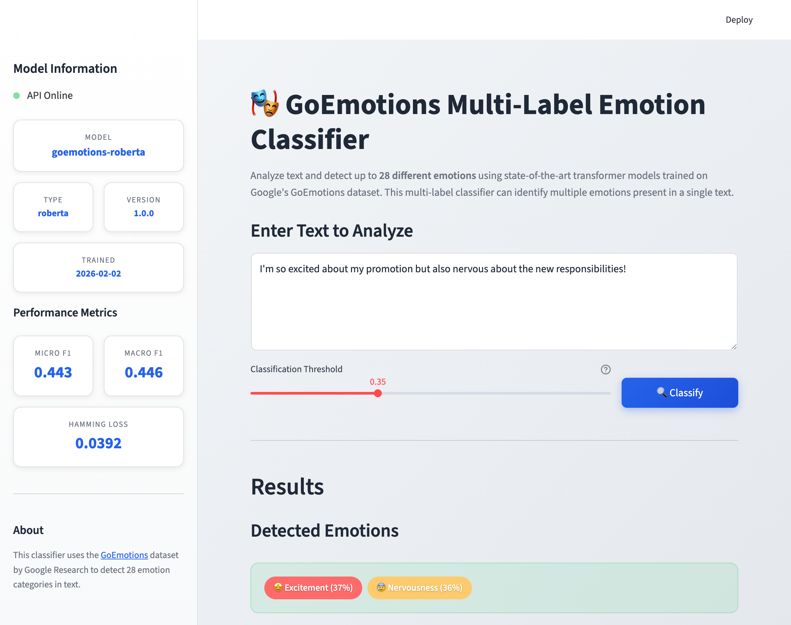

## Docker

### Build

```bash
# First, train a model
uv run python -m src.train.train --model tfidf

# Build the Docker image
docker build -t goemotions-classifier .
```

### Run

```bash
docker run -p 8000:8000 goemotions-classifier
```

### Test

```bash
curl http://localhost:8000/
curl -X POST http://localhost:8000/predict \
  -H "Content-Type: application/json" \
  -d '{"text": "This is amazing!"}'
```

## Project Structure

```
goemotions-classifier/
├── app/
│   └── streamlit_app.py    # Streamlit web UI
├── dataset/                 # Downloaded dataset cache
├── models/                  # Saved trained models
│   ├── tfidf_baseline/     # TF-IDF model artifacts
│   ├── roberta/            # RoBERTa model artifacts
│   └── deberta/            # DeBERTa model artifacts
├── notebooks/
│   └── notebook.ipynb      # EDA and experiments
├── screenshots/            # Documentation screenshots
├── src/
│   ├── __init__.py
│   ├── constants.py        # Shared constants
│   ├── data.py             # Dataset loading utilities
│   ├── utils.py            # Helper functions
│   ├── train/
│   │   └── train.py        # Training script
│   └── predict/
│       └── predict.py      # FastAPI service
├── .python-version
├── pyproject.toml
├── Dockerfile
├── docker-compose.yml      # Multi-service deployment
└── README.md
```

## Model Performance

### Model Comparison

| Model | Micro F1 | Macro F1 | Hamming Loss | Training Time |
|-------|----------|----------|--------------|---------------|
| **TF-IDF Baseline** | 0.449 | 0.400 | 0.066 | ~2 min (CPU) |
| **RoBERTa-base** | 0.443 | **0.446** | **0.039** | ~35 min (MPS) |
| DeBERTa-v3-large* | ~0.50 | ~0.52 | ~0.035 | ~2h (CUDA) |

*\*DeBERTa requires CUDA GPU with 16GB+ VRAM*

### Key Findings

- **TF-IDF** achieves competitive Micro F1 with minimal compute resources
- **RoBERTa** significantly outperforms TF-IDF on Macro F1 (+11%) and Hamming Loss (-40%)
- Higher Macro F1 indicates better handling of class imbalance
- Lower Hamming Loss indicates fewer incorrect predictions overall

### Per-Class F1 Scores (RoBERTa)

**Best performing emotions:**
| Emotion | F1 Score |
|---------|----------|
| gratitude | 0.909 |
| amusement | 0.790 |
| love | 0.781 |
| remorse | 0.722 |
| admiration | 0.675 |

**Challenging emotions (class imbalance):**
| Emotion | F1 Score |
|---------|----------|
| neutral | 0.002 |
| approval | 0.059 |
| annoyance | 0.105 |

*Note: Low scores for `neutral`, `approval`, `annoyance` are typical for GoEmotions due to label ambiguity and class overlap.*

## Configuration

### Training Options

```bash
python -m src.train.train --help

Options:
  --model         Model type: tfidf, roberta, deberta, all
  --output-dir    Directory to save models (default: models)
  --epochs        Training epochs (neural models)
  --batch-size    Batch size (neural models)
  --learning-rate Learning rate (neural models)
  --seed          Random seed for reproducibility
```

### Environment Variables

| Variable | Description | Default |
|----------|-------------|---------|
| `FORCE_CPU` | Force CPU usage | Not set |
| `PYTORCH_MPS_HIGH_WATERMARK_RATIO` | MPS memory ratio | Not set |

## Hardware Requirements

### Minimum

- 8GB RAM
- CPU with AVX support

### Recommended

- 16GB RAM
- GPU with 8GB+ VRAM (for neural models)
- CUDA 12.6+ (Windows/Linux) or MPS (Mac M1/M2/M3)

## Dataset

The [GoEmotions](https://arxiv.org/abs/2005.00547) dataset contains ~58,000 Reddit comments labeled with 28 emotion categories.

- **Train**: ~43,000 samples
- **Validation**: ~5,400 samples
- **Test**: ~5,400 samples

The dataset is automatically downloaded from HuggingFace on first use.

## Screenshots

### 📊 Exploratory Data Analysis

<table>
<tr>
<td width="50%">
<strong>Missing Values Analysis</strong><br>
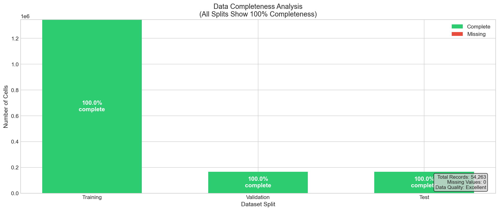
</td>
<td width="50%">
<strong>Class Distribution</strong><br>
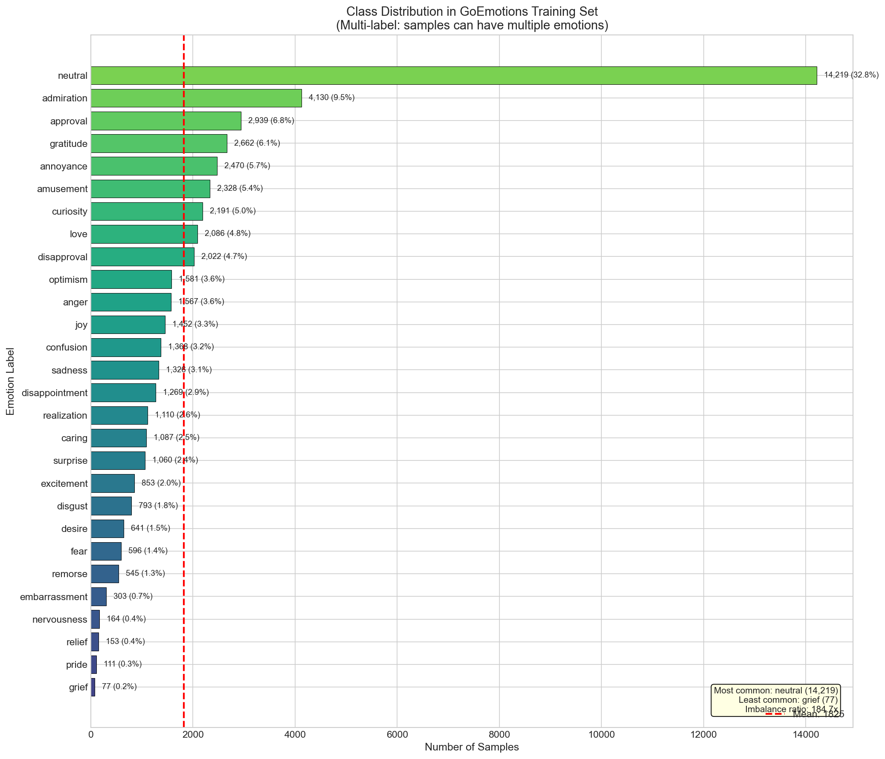
</td>
</tr>
<tr>
<td width="50%">
<strong>Labels per Sample</strong><br>
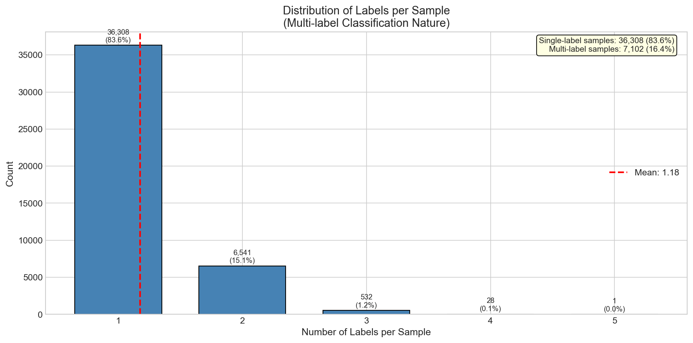
</td>
<td width="50%">
<strong>Text Length Distribution</strong><br>
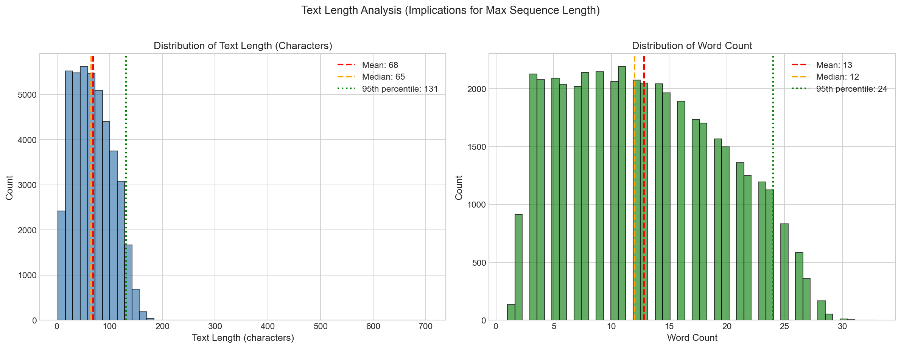
</td>
</tr>
</table>

**Word Clouds by Emotion:**

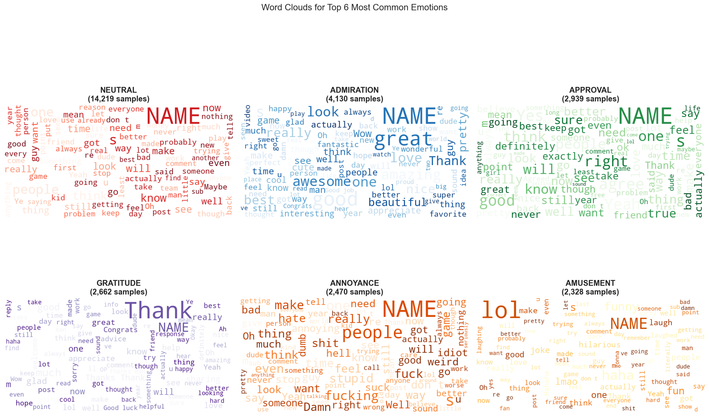

**Label Co-occurrence Matrix:**

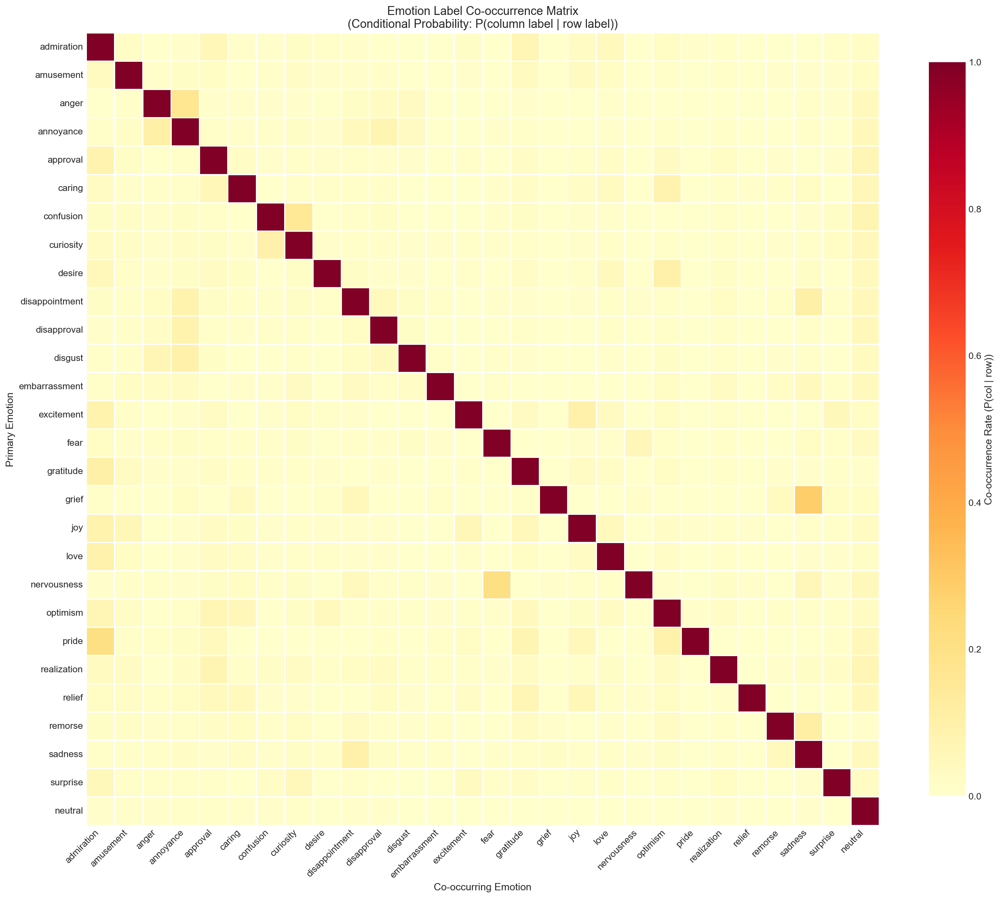

### 🎯 Model Training & Optimization

<table>
<tr>
<td width="50%">
<strong>TF-IDF Threshold Optimization</strong><br>
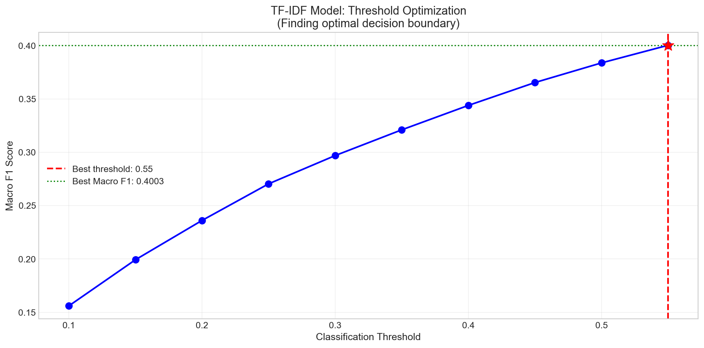
</td>
<td width="50%">
<strong>Feature Importance (Top Words)</strong><br>
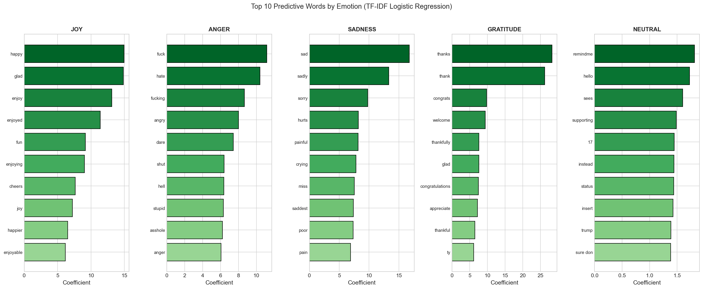
</td>
</tr>
</table>

### 📈 Model Comparison

<table>
<tr>
<td width="50%">
<strong>Model Metrics Comparison</strong><br>
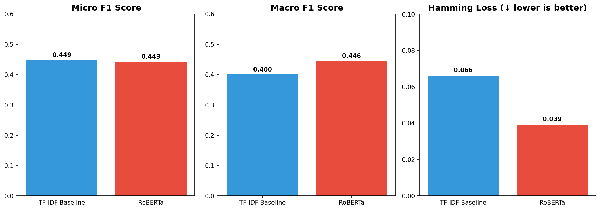
</td>
<td width="50%">
<strong>Per-Class F1 Scores</strong><br>
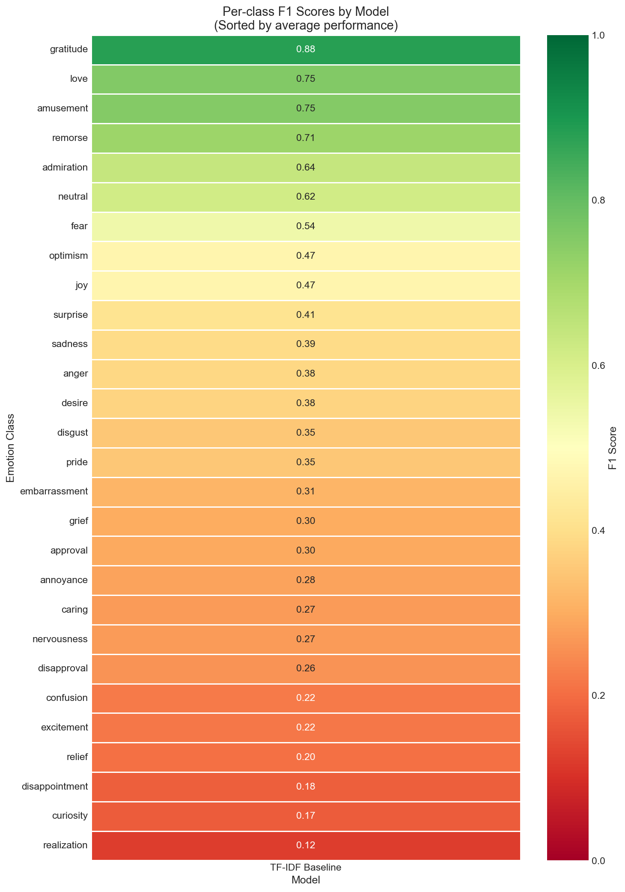
</td>
</tr>
</table>

### 🚀 API Documentation

<table>
<tr>
<td width="50%">
<strong>Swagger UI</strong><br>
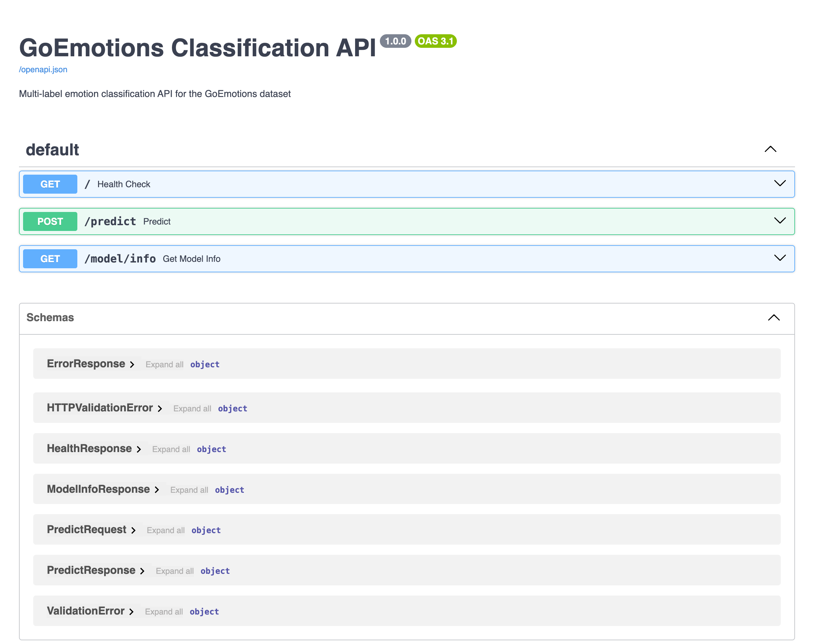
</td>
<td width="50%">
<strong>Predict Endpoint</strong><br>
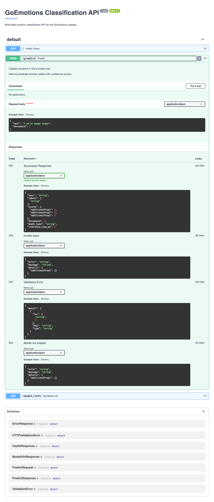
</td>
</tr>
</table>

## License

This project is licensed under the MIT License.

## Acknowledgments

- [GoEmotions](https://github.com/google-research/google-research/tree/master/goemotions) by Google Research
- [HuggingFace Transformers](https://huggingface.co/transformers/)
- [FastAPI](https://fastapi.tiangolo.com/)
